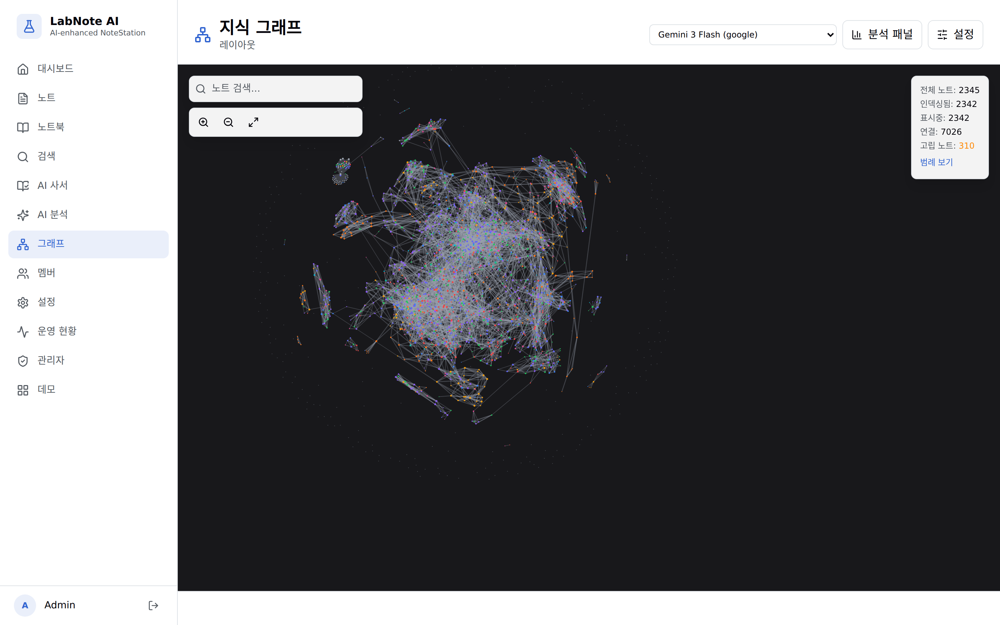
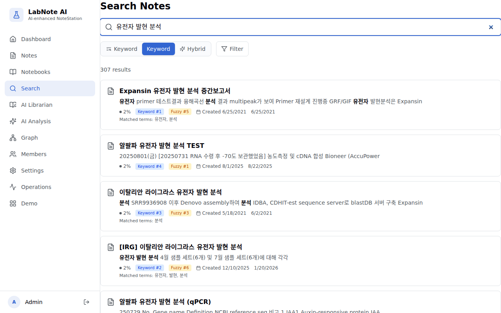
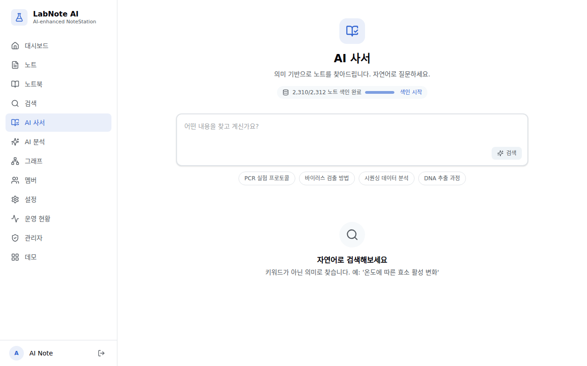
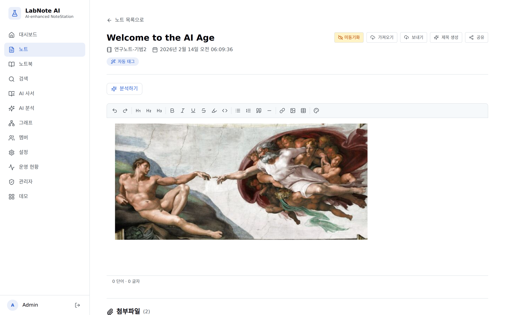
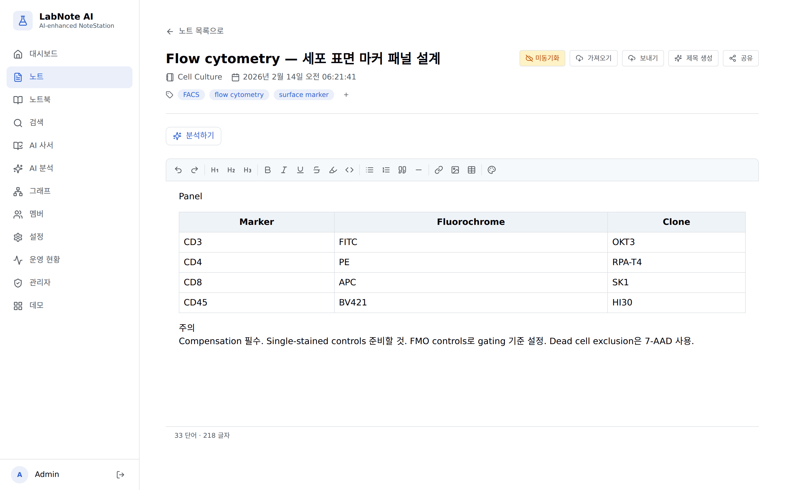

<p align="right">
  <a href="README.md"></a>
</p>

# LabNote AI

**Thousands of research notes on your NAS. Now you can actually find them.**

<p align="left">
  
  
  
  
</p>

<p align="center">
  
</p>

Once you have thousands of notes in Synology NoteStation, search breaks down. Misspell one keyword and it's gone. Browsing by topic? Forget it. You wrote it down somewhere — you just can't find it.

LabNote AI sits on top of your existing NAS notes and adds AI-powered search and knowledge discovery. No cloud. Your server. Your data.

```bash
git clone https://github.com/Key-man-fromArchive/ai-notestation.git && cd ai-notestation
bash install.sh        # Interactive setup. Enter NAS address and AI keys (or skip)
# → http://localhost:3000
```

---

## What it does

<table>
<tr>
<td width="50%">



**Search that actually works**
FTS + fuzzy + semantic search running in a single PostgreSQL. Finds notes even with typos. Finds notes by meaning. Shows you *why* each result matched.

</td>
<td width="50%">



**Ask in plain language**
"How does enzyme activity change with temperature" — search by question, not keywords. The AI Librarian finds relevant notes across your entire collection, ranked by relevance.

</td>
</tr>
<tr>
<td width="50%">



**Images, tables, code blocks**
Write research notes with a TipTap rich editor. Supports image attachments, tables, and code blocks. Attached images are automatically analyzed via OCR/Vision.

</td>
<td width="50%">



**AI analyzes your notes**
Insight extraction, auto-tagging, related note recommendations, rediscovery of forgotten notes. Also helps with proofreading and drafting research notes.

</td>
</tr>
</table>

---

## Key Features

**Hybrid Search** — tsvector (BM25) + pg_trgm (fuzzy) + pgvector (semantic) merged via Reciprocal Rank Fusion. One PostgreSQL, no separate vector DB. Automatically skips embedding calls when keyword results are sufficient (Adaptive Search).

**4 AI Providers** — OpenAI, Anthropic, Google, ZhipuAI. Drop your API key in an env var, it's auto-detected. Switch models freely. SSE streaming. Have a ChatGPT/Gemini subscription? Connect via OAuth — no separate key needed.

**AI Quality Assurance** — Generated output is self-verified against a checklist; failures trigger regeneration. Search QA evaluates correctness and utility separately. Repetition and format drift are caught in real-time during streaming.

**Content Intelligence** — Auto-tagging, related note discovery, forgotten note rediscovery. AI maps relationships between notes automatically.

**Multimodal Image Analysis** — PDF text extraction (PyMuPDF). 3-engine hybrid OCR (GLM-OCR → PaddleOCR-VL → AI Vision) with automatic fallback. Batch processing runs OCR and Vision description generation as independent parallel pipelines. Extracted text and image descriptions are auto-indexed, making images searchable by their visual content.

**Synology Integration** — Bidirectional sync with NoteStation. Image attachments. Direct NSX file import. Works without a NAS too — create notes locally.

---

## Tech Stack

| Area | Technology |
|------|-----------|
| Backend | FastAPI + SQLAlchemy 2.0 (async) + Alembic |
| Frontend | React 19 + Vite + TailwindCSS + shadcn/ui |
| Database | PostgreSQL 16 + pgvector |
| Search | tsvector + pg_trgm + pgvector + RRF |
| AI | OpenAI, Anthropic, Google, ZhipuAI (auto-detected) |
| OCR/Vision | GLM-OCR, PaddleOCR-VL, AI Vision (auto-fallback) |
| Auth | JWT + OAuth 2.0 (Google, OpenAI PKCE) |
| Deploy | Docker Compose (3 containers) |

---

## Quick Start

All you need is Docker. NAS and AI keys are optional.

```bash
git clone https://github.com/Key-man-fromArchive/ai-notestation.git
cd ai-notestation
bash install.sh
```

The install script handles environment setup, container launch, and DB migrations. Sign up at http://localhost:3000 when it's done.

> Non-interactive: `bash install.sh -y` — installs with defaults. Add keys later from the web UI.

<details>
<summary>Manual install</summary>

```bash
cp .env.example .env

# Generate security keys
JWT_SECRET=$(openssl rand -base64 32)
OAUTH_KEY=$(python3 -c "from cryptography.fernet import Fernet; print(Fernet.generate_key().decode())" 2>/dev/null || openssl rand -base64 32)
sed -i "s|^JWT_SECRET=.*|JWT_SECRET=${JWT_SECRET}|" .env
sed -i "s|^OAUTH_ENCRYPTION_KEY=.*|OAUTH_ENCRYPTION_KEY=${OAUTH_KEY}|" .env

# Edit .env for NAS address and AI keys

docker compose up -d --build
docker compose exec backend alembic upgrade head
# Frontend → http://localhost:3000
# API Docs → http://localhost:8001/docs
```

</details>

<details>
<summary>Local development</summary>

```bash
# Backend
cd backend && pip install -e ".[dev]"
uvicorn app.main:app --reload --port 8000

# Frontend
cd frontend && npm install && npm run dev
```

</details>

---

<details>
<summary><strong>Architecture</strong></summary>

```
┌─────────────────────────────────────────────────────────────┐
│                        Frontend (React 19)                  │
│  ┌──────────┬──────────┬───────────┬──────────┬──────────┐  │
│  │Dashboard │  Notes   │  Search   │    AI    │  Graph   │  │
│  │          │ Notebooks│ Librarian │ Analysis │Discovery │  │
│  └──────────┴──────────┴───────────┴──────────┴──────────┘  │
│         TanStack Query  ·  SSE Streaming  ·  shadcn/ui      │
└─────────────────────────┬───────────────────────────────────┘
                          │ REST API + SSE
┌─────────────────────────┴───────────────────────────────────┐
│                      Backend (FastAPI)                       │
│  ┌──────────────────────────────────────────────────────┐   │
│  │  API Layer: auth · notes · search · ai · sync · ...  │   │
│  ├──────────────────────────────────────────────────────┤   │
│  │  AI Router ─── OpenAI │ Anthropic │ Google │ ZhipuAI │   │
│  ├──────────────────────────────────────────────────────┤   │
│  │  Search Engine ─── FTS + Trigram + Semantic (RRF)    │   │
│  ├──────────────────────────────────────────────────────┤   │
│  │  Quality Gate ─── Checklist │ QA Eval │ Stream Mon   │   │
│  ├──────────────────────────────────────────────────────┤   │
│  │  Image Analysis ─── 3-Engine OCR │ Vision │ Batch    │   │
│  ├──────────────────────────────────────────────────────┤   │
│  │  Synology Gateway ─── NoteStation + FileStation API  │   │
│  └──────────────────────────────────────────────────────┘   │
└─────────────────────────┬───────────────────────────────────┘
                          │
          ┌───────────────┼───────────────┐
          ▼               ▼               ▼
┌──────────────┐ ┌──────────────┐ ┌──────────────┐
│ PostgreSQL   │ │ Synology NAS │ │  AI Provider │
│ 16 + pgvec  │ │ NoteStation  │ │   APIs (4)   │
└──────────────┘ └──────────────┘ └──────────────┘
```

</details>

<details>
<summary><strong>Environment Variables</strong></summary>

| Variable | Description | Required |
|----------|-------------|:--------:|
| `DATABASE_URL` | PostgreSQL connection URL | Auto |
| `JWT_SECRET` | JWT signing key | Yes |
| `SYNOLOGY_URL` / `_USER` / `_PASSWORD` | NAS connection info | - |
| `OPENAI_API_KEY` | OpenAI API key | - |
| `ANTHROPIC_API_KEY` | Anthropic API key | - |
| `GOOGLE_API_KEY` | Google Gemini API key | - |
| `ZHIPUAI_API_KEY` | ZhipuAI API key | - |
| `OAUTH_ENCRYPTION_KEY` | OAuth token encryption key (Fernet) | - |
| `PADDLE_PDX_DISABLE_MODEL_SOURCE_CHECK` | Disable PaddleOCR external model source check (Docker default: True) | - |

Works without NAS (use NSX import or create notes locally). Works without AI keys (search and note management still function).

</details>

<details>
<summary><strong>Project Structure</strong></summary>

```
labnote-ai/
├── backend/
│   └── app/
│       ├── main.py              # FastAPI entrypoint
│       ├── api/                 # REST API routers
│       ├── ai_router/           # Multi-provider AI (providers, prompts, quality gate)
│       ├── search/              # Hybrid search (FTS, semantic, RRF, JUDGE)
│       ├── services/            # Business logic (OCR, Vision, tagging, related notes, PDF)
│       └── synology_gateway/    # NAS API wrappers
├── frontend/src/
│   ├── pages/                   # Pages (code-split)
│   ├── components/              # shadcn/ui + custom
│   └── hooks/                   # TanStack Query, SSE
└── docker-compose.yml           # 3-container deployment
```

</details>

<details>
<summary><strong>Testing & Linting</strong></summary>

```bash
cd backend && pytest --tb=short                              # Backend tests
cd backend && pytest --cov=app --cov-report=term-missing     # Coverage
cd frontend && npm test                                       # Frontend
cd frontend && npm run test:e2e                               # E2E (Playwright)
cd backend && ruff check . && ruff format --check .           # Lint
```

</details>

---

## Roadmap

- [x] Phase 1 — Search Enhancement (Why matched, Adaptive Search, Multi-turn Refinement)
- [x] Phase 2 — AI Quality Gates (Checklist, QA Evaluation, Stream Monitor)
- [x] Phase 3 — Content Intelligence (Auto-Tagging, Related Notes, Rediscovery)
- [x] Phase 4 — Multimodal (PDF extraction, 3-engine hybrid OCR, dual-pipeline Vision)
- [ ] Phase 5 — Evaluation Infrastructure (A/B framework, metrics dashboard, feedback loop)

Details: [ROADMAP.md](ROADMAP.md) · Changelog: [CHANGELOG.md](CHANGELOG.md)

---

## License

[AGPL-3.0](LICENSE) — Source disclosure obligation applies even when offered as a network service.
