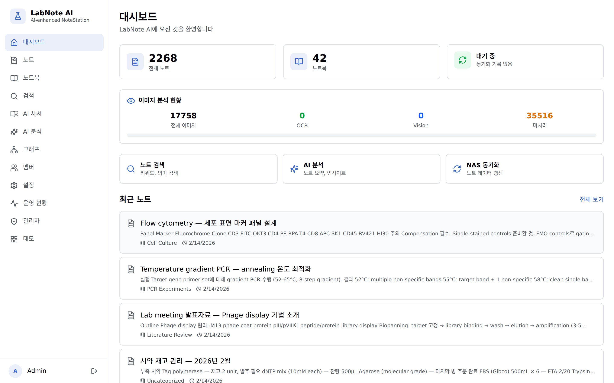
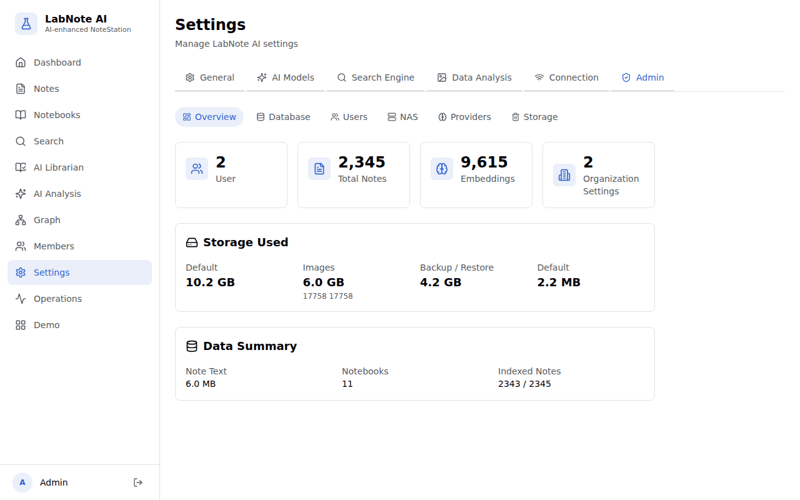

<p align="center">
  <a href="README.md"></a>
</p>

# LabNote AI

**Unlock the thousands of research notes on your NAS with local, privacy-first AI.**

<p align="left">
  
  
  
  
  
  
  
  
</p>

<p align="center">
  
</p>

You have 2,000+ notes in Synology NoteStation. You know the data is there, but keyword search fails on a single typo and browsing by topic is impossible. LabNote AI indexes everything — text, images, PDFs — into a hybrid search engine on your own server. Semantic search, AI Q&A, OCR, and knowledge graph — without handing your data to a SaaS provider.

```bash
git clone https://github.com/Key-man-fromArchive/ai-notestation.git && cd ai-notestation
bash install.sh        # Interactive setup. Enter NAS address and AI keys (or skip)
# → http://localhost:3000
```

---

## What It Does

<table>
<tr>
<td width="50%">


**Hybrid Search Engine**
Combines PostgreSQL `tsvector` (BM25), `pg_trgm` (fuzzy), and `pgvector` (semantic) into a single ranked list using Reciprocal Rank Fusion. Each result shows exactly why it matched — keyword, fuzzy, or semantic — with distinct engine badges.

</td>
<td width="50%">


**AI Librarian**
Ask questions in natural language across your entire note collection. Returns answers with relevance scores, citing specific sources. Maintains conversation history for iterative research.

</td>
</tr>
<tr>
<td width="50%">


**Note Editor**
TipTap rich editor with KaTeX math, tables, code blocks, and image attachments. Always editable with 3-second auto-save. AI auto-tagging generates structured metadata per note.

</td>
<td width="50%">


**AI Analysis**
5 structured AI tasks (Insight, Spell Check, Writing, Search Q&A, Template) with model selection across 4 providers. Checklist-based quality gate verifies output before delivery.

</td>
</tr>
<tr>
<td width="50%">



**Dashboard**
Track notes, notebooks, sync status, and image analysis progress at a glance. OCR and Vision pipeline status for thousands of images. Rediscovery cards surface forgotten but relevant notes.

</td>
<td width="50%">



**Administration**
6-tab settings panel covering AI models, search engine tuning, data analysis, and connections. Admin overview with DB stats, storage usage, and user management. Full backup/restore pipeline.

</td>
</tr>
</table>

---

## Key Features

### Search & Discovery
- **Hybrid Search** — `tsvector` (BM25) + `pg_trgm` (fuzzy) + `pgvector` (semantic), merged via Reciprocal Rank Fusion. Single PostgreSQL, no separate vector DB.
- **Adaptive Search** — JUDGE module evaluates FTS coverage and skips semantic search when keyword results are sufficient. Saves cost and latency.
- **Explainable Results** — Each result shows engine badges (Keyword #1, Fuzzy #5, Semantic) explaining why it matched.
- **Multi-turn Refinement** — AI-powered query expansion and narrowing with refinement history.
- **Knowledge Graph** — Force-directed visualization with AI-driven clustering. Graph insights persist to DB.

### AI Integration
- **4 Providers** — OpenAI, Anthropic, Google, ZhipuAI. Auto-detected from environment variables. Switch models freely.
- **5 AI Tasks** — Insight extraction, spell check, writing assist, search Q&A, template generation.
- **Quality Gate** — Checklist-based self-verification with conditional regeneration on failure.
- **Stream Monitor** — Detects repetition, language mismatch, and format drift during SSE streaming. Auto-retries.
- **OAuth** — Google OAuth 2.0 (Gemini quota) and OpenAI PKCE (ChatGPT subscription reuse).
- **AI Librarian** — Natural language Q&A with history tracking and relevance scoring.

### Multimodal
- **PDF Extraction** — Text extraction from PDF attachments via PyMuPDF. Auto-indexed for search.
- **3-Engine Hybrid OCR** — GLM-OCR → PaddleOCR-VL (local CPU) → AI Vision (cloud). Automatic fallback chain.
- **Dual Pipeline Batch** — OCR (concurrency=1) and Vision description (concurrency=8) run as independent parallel pipelines. One failing doesn't block the other.
- **Visual Search** — Extracted text and image descriptions are auto-indexed. Search images by their content.

### Editor & Notes
- **Rich Editor** — TipTap with KaTeX math, tables, code blocks, image drag-and-drop. 4-level width control.
- **Auto-Save** — 3-second debounce, 30-second periodic, save-on-navigate, Ctrl+S manual.
- **Auto-Tagging** — AI generates tags per note or in batch across entire notebooks.
- **Related Notes** — pgvector cosine similarity discovers connections between notes.
- **Rediscovery** — Surfaces old notes relevant to your current work on the dashboard.
- **NAS Sync** — Bidirectional sync with NoteStation. NSX import. Works without NAS too.

### Administration & Collaboration
- **Team RBAC** — Owner → Admin → Member → Viewer. Email invitation and signup approval.
- **Note Sharing** — Token-based public links with configurable expiry (1d / 7d / 30d / unlimited).
- **DB Backup/Restore** — pg_dump pipeline via admin UI. Settings backup export/import.
- **Operations Console** — NAS sync, search indexing, search engine monitoring. Activity log with 10 categories.
- **i18n** — Korean and English UI. Browser language auto-detection.

---

## Tech Stack

| Area | Technology |
|------|-----------|
| Backend | FastAPI + SQLAlchemy 2.0 (async) + Alembic |
| Frontend | React 19 + Vite + TailwindCSS + shadcn/ui |
| Database | PostgreSQL 16 + pgvector |
| Search | tsvector + pg_trgm + pgvector + RRF |
| AI | OpenAI, Anthropic, Google, ZhipuAI (auto-detected) |
| OCR/Vision | GLM-OCR, PaddleOCR-VL, AI Vision (auto-fallback) |
| Auth | JWT + OAuth 2.0 (Google, OpenAI PKCE) |
| Deploy | Docker Compose (3 containers) |

**By the numbers:** 131 API endpoints · 21 DB migrations · 18 pages · 30 hooks · 900 i18n keys

---

<details>
<summary><strong>Architecture</strong></summary>

```
┌─────────────────────────────────────────────────────────────┐
│                        Frontend (React 19)                  │
│  ┌──────────┬──────────┬───────────┬──────────┬──────────┐  │
│  │Dashboard │  Notes   │  Search   │    AI    │  Graph   │  │
│  │          │ Notebooks│ Librarian │ Analysis │Discovery │  │
│  └──────────┴──────────┴───────────┴──────────┴──────────┘  │
│         TanStack Query  ·  SSE Streaming  ·  shadcn/ui      │
└─────────────────────────┬───────────────────────────────────┘
                          │ REST API + SSE
┌─────────────────────────┴───────────────────────────────────┐
│                      Backend (FastAPI)                       │
│  ┌──────────────────────────────────────────────────────┐   │
│  │  API Layer (131 endpoints)                            │   │
│  │  auth · notes · search · ai · sync · files · admin    │   │
│  ├──────────────────────────────────────────────────────┤   │
│  │  AI Router ─── OpenAI │ Anthropic │ Google │ ZhipuAI │   │
│  ├──────────────────────────────────────────────────────┤   │
│  │  Search Engine ─── FTS + Trigram + Semantic (RRF)    │   │
│  ├──────────────────────────────────────────────────────┤   │
│  │  Quality Gate ─── Checklist │ QA Eval │ Stream Mon   │   │
│  ├──────────────────────────────────────────────────────┤   │
│  │  Image Analysis ─── 3-Engine OCR │ Vision │ Batch    │   │
│  ├──────────────────────────────────────────────────────┤   │
│  │  Synology Gateway ─── NoteStation + FileStation API  │   │
│  └──────────────────────────────────────────────────────┘   │
└─────────────────────────┬───────────────────────────────────┘
                          │
          ┌───────────────┼───────────────┐
          ▼               ▼               ▼
┌──────────────┐ ┌──────────────┐ ┌──────────────┐
│ PostgreSQL   │ │ Synology NAS │ │  AI Provider │
│ 16 + pgvec  │ │ NoteStation  │ │   APIs (4)   │
└──────────────┘ └──────────────┘ └──────────────┘
```

</details>

## Quick Start

All you need is Docker. NAS and AI keys are optional.

```bash
git clone https://github.com/Key-man-fromArchive/ai-notestation.git
cd ai-notestation
bash install.sh
```

The install script handles environment setup, container launch, and DB migrations. Sign up at http://localhost:3000 when it's done.

> Non-interactive: `bash install.sh -y` — installs with defaults. Add keys later from the web UI settings.

<details>
<summary>Manual install</summary>

```bash
cp .env.example .env

# Generate security keys
JWT_SECRET=$(openssl rand -base64 32)
OAUTH_KEY=$(python3 -c "from cryptography.fernet import Fernet; print(Fernet.generate_key().decode())" 2>/dev/null || openssl rand -base64 32)
sed -i "s|^JWT_SECRET=.*|JWT_SECRET=${JWT_SECRET}|" .env
sed -i "s|^OAUTH_ENCRYPTION_KEY=.*|OAUTH_ENCRYPTION_KEY=${OAUTH_KEY}|" .env

# Edit .env for NAS address and AI keys

docker compose up -d --build
docker compose exec backend alembic upgrade head
# Frontend → http://localhost:3000
# API Docs → http://localhost:8001/docs
```

</details>

<details>
<summary>Local development</summary>

```bash
# Backend
cd backend && pip install -e ".[dev]"
uvicorn app.main:app --reload --port 8000

# Frontend
cd frontend && npm install && npm run dev
```

</details>

<details>
<summary>Environment Variables</summary>

| Variable | Description | Required |
|----------|-------------|:--------:|
| `DATABASE_URL` | PostgreSQL connection URL | Auto |
| `JWT_SECRET` | JWT signing key | Yes |
| `SYNOLOGY_URL` / `_USER` / `_PASSWORD` | NAS connection info | - |
| `OPENAI_API_KEY` | OpenAI API key | - |
| `ANTHROPIC_API_KEY` | Anthropic API key | - |
| `GOOGLE_API_KEY` | Google Gemini API key | - |
| `ZHIPUAI_API_KEY` | ZhipuAI API key | - |
| `OAUTH_ENCRYPTION_KEY` | OAuth token encryption key (Fernet) | - |

Works without NAS (use NSX import or create notes locally). Works without AI keys (search and note management still function).

</details>

<details>
<summary>Project Structure</summary>

```
labnote-ai/
├── backend/
│   └── app/
│       ├── main.py              # FastAPI entrypoint
│       ├── api/                 # 131 REST API endpoints
│       ├── ai_router/           # Multi-provider AI (providers, prompts, quality gate)
│       ├── search/              # Hybrid search (FTS, semantic, RRF, JUDGE)
│       ├── services/            # OCR, Vision, tagging, related notes, PDF, backup
│       └── synology_gateway/    # NAS API wrappers
├── frontend/src/
│   ├── pages/                   # 18 pages (code-split)
│   ├── components/              # shadcn/ui + custom
│   └── hooks/                   # 30 hooks (TanStack Query, SSE)
└── docker-compose.yml           # 3-container deployment
```

</details>

<details>
<summary>Testing & Linting</summary>

```bash
cd backend && pytest --tb=short                              # Backend tests
cd backend && pytest --cov=app --cov-report=term-missing     # Coverage
cd frontend && npm test                                       # Frontend
cd frontend && npm run test:e2e                               # E2E (Playwright)
cd backend && ruff check . && ruff format --check .           # Lint
```

</details>

---

## Roadmap

- [x] Phase 1 — Search Enhancement (Why matched, Adaptive Search, Multi-turn Refinement)
- [x] Phase 2 — AI Quality Gates (Checklist, QA Evaluation, Stream Monitor)
- [x] Phase 3 — Content Intelligence (Auto-Tagging, Related Notes, Rediscovery, Graph Insights)
- [x] Phase 4 — Multimodal (PDF extraction, 3-engine hybrid OCR, dual-pipeline Vision)
- [ ] Phase 5 — Evaluation Infrastructure (A/B framework, metrics dashboard, feedback loop)

Details: [ROADMAP.md](ROADMAP.md) · Changelog: [CHANGELOG.md](CHANGELOG.md)

---

## License

[AGPL-3.0](LICENSE) — Source disclosure obligation applies even when offered as a network service.
