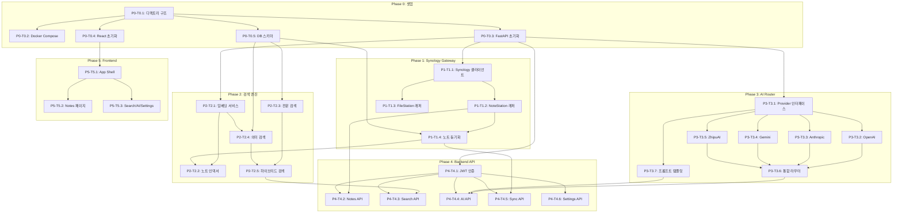

# TASKS: LabNote AI

## 메타
- **설계 문서**: `docs/plans/2026-01-29-labnote-ai-design.md`
- **스택**: FastAPI (Python 3.12+) + React 19 + Vite + TailwindCSS + PostgreSQL 16 + pgvector
- **태스크**: 30개 (P0: 5, P1: 4, P2: 5, P3: 7, P4: 6, P5: 3)
- **Git Remote**: `https://github.com/Key-man-fromArchive/ai-notestation.git`

---

## P0: 프로젝트 셋업

### [ ] P0-T0.1: 모노레포 디렉토리 구조 생성
- **담당**: backend-specialist
- **작업**: `backend/`, `frontend/`, `docs/` 디렉토리 및 루트 설정 파일 생성
- **산출물**: `backend/pyproject.toml`, `backend/app/__init__.py`, `frontend/package.json`, `.env.example`, `.gitignore`
- **Worktree**: ❌ (main 직접)

### [ ] P0-T0.2: Docker Compose 환경 구성
- **담당**: backend-specialist
- **작업**: FastAPI + PostgreSQL(pgvector) + React 프론트엔드 3-컨테이너 구성
- **산출물**: `docker-compose.yml`, `backend/Dockerfile`, `frontend/Dockerfile`
- **Worktree**: ❌ (main 직접)

### [ ] P0-T0.3: FastAPI 백엔드 초기화
- **담당**: backend-specialist
- **작업**: FastAPI 앱 엔트리포인트, pydantic-settings 설정, SQLAlchemy 연결, Alembic 마이그레이션 초기화
- **산출물**: `backend/app/main.py`, `backend/app/config.py`, `backend/app/database.py`, `backend/alembic/`
- **Worktree**: ❌ (main 직접)

### [ ] P0-T0.4: React 프론트엔드 초기화
- **담당**: frontend-specialist
- **작업**: Vite + React 19 + TailwindCSS + shadcn/ui + TanStack Query + react-router 프로젝트 생성. Light mode only.
- **산출물**: `frontend/src/main.tsx`, `frontend/src/App.tsx`, `frontend/vite.config.ts`, `frontend/tailwind.config.ts`
- **Worktree**: ❌ (main 직접)

### [ ] P0-T0.5: PostgreSQL 스키마 + pgvector 마이그레이션
- **담당**: database-specialist
- **작업**: notes, note_embeddings, settings 테이블 생성. tsvector GIN 인덱스, ivfflat 벡터 인덱스 구성
- **산출물**: `backend/alembic/versions/001_initial_schema.py`, `backend/app/models.py`
- **Worktree**: ❌ (main 직접)

---

## P1: Synology Gateway

### [ ] P1-T1.1: Synology 클라이언트 (인증/세션 관리)
- **담당**: backend-specialist
- **파일**: `backend/tests/test_synology_client.py` → `backend/app/synology_gateway/client.py`
- **스펙**: synology-api 라이브러리를 래핑. 환경변수 기반 인증, 세션 유지, 만료 시 자동 재인증
- **AC**: 인증 실패 시 명확한 에러 반환, 세션 만료 감지 및 자동 갱신
- **Worktree**: `worktree/phase-1-synology-gateway`
- **TDD**: RED → GREEN → REFACTOR
- **병렬**: 독립 실행

### [ ] P1-T1.2: NoteStation API 래퍼
- **담당**: backend-specialist
- **의존**: T1.1 (Mock: `mockSynologyClient`)
- **파일**: `backend/tests/test_notestation.py` → `backend/app/synology_gateway/notestation.py`
- **스펙**: note_list, specific_note_id, notebooks_info, tags_info, todo, shortcuts, smart 메서드 래핑
- **AC**: 모든 NoteStation API 호출을 async로 래핑, HTML 본문 파싱하여 plain text 추출
- **Worktree**: `worktree/phase-1-synology-gateway`
- **TDD**: RED → GREEN → REFACTOR
- **병렬**: T1.3과 병렬 가능 (Mock 사용)

### [ ] P1-T1.3: FileStation API 래퍼
- **담당**: backend-specialist
- **의존**: T1.1 (Mock: `mockSynologyClient`)
- **파일**: `backend/tests/test_filestation.py` → `backend/app/synology_gateway/filestation.py`
- **스펙**: 첨부파일 업로드/다운로드/목록 조회. File Station API Guide 참조
- **AC**: 파일 업로드 시 경로 검증, 다운로드 시 스트리밍 응답
- **Worktree**: `worktree/phase-1-synology-gateway`
- **TDD**: RED → GREEN → REFACTOR
- **병렬**: T1.2와 병렬 가능 (Mock 사용)

### [ ] P1-T1.4: 노트 동기화 서비스
- **담당**: backend-specialist
- **의존**: T1.2, P0-T0.5 (Mock: `mockNoteStation`, `mockDB`)
- **파일**: `backend/tests/test_sync_service.py` → `backend/app/services/sync_service.py`
- **스펙**: NoteStation → PostgreSQL 동기화. 변경 감지, 증분 동기화, HTML→텍스트 파싱
- **AC**: 새 노트 추가, 수정된 노트 업데이트, 삭제된 노트 제거. synced_at 타임스탬프 관리
- **Worktree**: `worktree/phase-1-synology-gateway`
- **TDD**: RED → GREEN → REFACTOR
- **병렬**: T1.2 완료 후 실행

---

## P2: 검색 엔진

### [ ] P2-T2.1: 임베딩 생성 서비스
- **담당**: backend-specialist
- **파일**: `backend/tests/test_embeddings.py` → `backend/app/search/embeddings.py`
- **스펙**: 텍스트를 벡터 임베딩으로 변환. OpenAI text-embedding-3-small 기본. 설정에서 모델 변경 가능
- **AC**: 500토큰 단위 청크 분할 (50토큰 오버랩), 배치 임베딩 지원
- **Worktree**: `worktree/phase-2-search`
- **TDD**: RED → GREEN → REFACTOR
- **병렬**: 독립 실행

### [ ] P2-T2.2: 노트 인덱서
- **담당**: backend-specialist
- **의존**: T2.1, P1-T1.4 (Mock: `mockEmbeddings`, `mockSyncService`)
- **파일**: `backend/tests/test_indexer.py` → `backend/app/search/indexer.py`
- **스펙**: 동기화된 노트를 전문 인덱스(tsvector) + 벡터 임베딩으로 인덱싱
- **AC**: 노트 동기화 후 자동 인덱싱 트리거, 기존 임베딩 중복 방지
- **Worktree**: `worktree/phase-2-search`
- **TDD**: RED → GREEN → REFACTOR
- **병렬**: T2.1 완료 후 실행

### [ ] P2-T2.3: 전문 검색 (Full-text Search)
- **담당**: backend-specialist
- **파일**: `backend/tests/test_fts.py` → `backend/app/search/engine.py`
- **스펙**: PostgreSQL tsvector 기반 전문 검색. 제목 가중치(A), 본문 가중치(B)
- **AC**: ts_rank 기반 점수 반환, 한글/영어 모두 검색 가능 (simple config)
- **Worktree**: `worktree/phase-2-search`
- **TDD**: RED → GREEN → REFACTOR
- **병렬**: T2.4와 병렬 가능

### [ ] P2-T2.4: 의미 검색 (Semantic Search)
- **담당**: backend-specialist
- **의존**: T2.1 (Mock: `mockEmbeddings`)
- **파일**: `backend/tests/test_semantic.py` → `backend/app/search/engine.py` (확장)
- **스펙**: 쿼리 임베딩 생성 → pgvector 코사인 유사도 검색
- **AC**: 상위 N개 결과 + 유사도 점수 반환
- **Worktree**: `worktree/phase-2-search`
- **TDD**: RED → GREEN → REFACTOR
- **병렬**: T2.3과 병렬 가능

### [ ] P2-T2.5: 하이브리드 검색 (RRF 병합)
- **담당**: backend-specialist
- **의존**: T2.3, T2.4
- **파일**: `backend/tests/test_hybrid_search.py` → `backend/app/search/engine.py` (확장)
- **스펙**: 전문검색 + 의미검색 결과를 RRF(Reciprocal Rank Fusion)로 병합. Progressive search: FTS 먼저 반환, 의미검색 비동기 병합
- **AC**: 두 검색의 결과를 단일 순위로 병합, 전문검색 결과는 즉시 반환
- **Worktree**: `worktree/phase-2-search`
- **TDD**: RED → GREEN → REFACTOR
- **병렬**: T2.3, T2.4 완료 후 실행

---

## P3: AI Router

### [ ] P3-T3.1: AI Provider 추상 인터페이스 + 스키마
- **담당**: backend-specialist
- **파일**: `backend/tests/test_ai_schemas.py` → `backend/app/ai_router/providers/base.py`, `backend/app/ai_router/schemas.py`
- **스펙**: AIProvider ABC (chat, stream, available_models), Message/AIResponse/ModelInfo 스키마
- **AC**: 모든 provider가 동일한 인터페이스 구현, Pydantic 스키마로 타입 안전성 보장
- **Worktree**: `worktree/phase-3-ai-router`
- **TDD**: RED → GREEN → REFACTOR
- **병렬**: 독립 실행

### [ ] P3-T3.2: OpenAI Provider
- **담당**: backend-specialist
- **의존**: T3.1 (Mock: `mockBaseProvider`)
- **파일**: `backend/tests/test_openai_provider.py` → `backend/app/ai_router/providers/openai.py`
- **스펙**: openai SDK로 GPT-4o, GPT-4o-mini 지원. chat + streaming
- **AC**: 스트리밍 응답 AsyncIterator 반환, API 키 미설정 시 명확한 에러
- **Worktree**: `worktree/phase-3-ai-router`
- **TDD**: RED → GREEN → REFACTOR
- **병렬**: T3.3, T3.4, T3.5와 병렬 가능

### [ ] P3-T3.3: Anthropic Provider
- **담당**: backend-specialist
- **의존**: T3.1 (Mock: `mockBaseProvider`)
- **파일**: `backend/tests/test_anthropic_provider.py` → `backend/app/ai_router/providers/anthropic.py`
- **스펙**: anthropic SDK로 Claude 3.5 Sonnet, Claude 3 Haiku 지원. chat + streaming
- **AC**: Anthropic 메시지 형식 변환, 스트리밍 지원
- **Worktree**: `worktree/phase-3-ai-router`
- **TDD**: RED → GREEN → REFACTOR
- **병렬**: T3.2, T3.4, T3.5와 병렬 가능

### [ ] P3-T3.4: Google Gemini Provider
- **담당**: backend-specialist
- **의존**: T3.1 (Mock: `mockBaseProvider`)
- **파일**: `backend/tests/test_google_provider.py` → `backend/app/ai_router/providers/google.py`
- **스펙**: google-genai SDK로 Gemini 2.0 Flash, Gemini Pro 지원. chat + streaming
- **AC**: Google 메시지 형식 변환, 스트리밍 지원
- **Worktree**: `worktree/phase-3-ai-router`
- **TDD**: RED → GREEN → REFACTOR
- **병렬**: T3.2, T3.3, T3.5와 병렬 가능

### [ ] P3-T3.5: ZhipuAI Provider
- **담당**: backend-specialist
- **의존**: T3.1 (Mock: `mockBaseProvider`)
- **파일**: `backend/tests/test_zhipuai_provider.py` → `backend/app/ai_router/providers/zhipuai.py`
- **스펙**: zhipuai SDK로 GLM-4, GLM-4-Flash 지원. chat + streaming
- **AC**: ZhipuAI 메시지 형식 변환, 스트리밍 지원
- **Worktree**: `worktree/phase-3-ai-router`
- **TDD**: RED → GREEN → REFACTOR
- **병렬**: T3.2, T3.3, T3.4와 병렬 가능

### [ ] P3-T3.6: AI 통합 라우터 + SSE 스트리밍
- **담당**: backend-specialist
- **의존**: T3.2, T3.3, T3.4, T3.5
- **파일**: `backend/tests/test_ai_router.py` → `backend/app/ai_router/router.py`
- **스펙**: 모델 수동 선택 + 자동 라우팅. FastAPI StreamingResponse로 SSE 엔드포인트 제공
- **AC**: 사용 가능한 provider만 라우팅, SSE `text/event-stream` 응답, 미설정 provider는 목록에서 제외
- **Worktree**: `worktree/phase-3-ai-router`
- **TDD**: RED → GREEN → REFACTOR
- **병렬**: T3.2~T3.5 완료 후 실행

### [ ] P3-T3.7: AI 프롬프트 템플릿 (5가지 기능)
- **담당**: backend-specialist
- **파일**: `backend/tests/test_prompts.py` → `backend/app/ai_router/prompts/`
- **스펙**: insight.py(인사이트 도출), search_qa.py(RAG 검색 QA), writing.py(연구노트 작성), spellcheck.py(맞춤법 교정), template.py(템플릿 생성)
- **AC**: 각 프롬프트는 한국어/영어 지원, 시스템 프롬프트 + 사용자 프롬프트 구조
- **Worktree**: `worktree/phase-3-ai-router`
- **TDD**: RED → GREEN → REFACTOR
- **병렬**: T3.1 완료 후 독립 실행 (T3.2~T3.6과 병렬 가능)

---

## P4: Backend API 레이어

### [ ] P4-T4.1: JWT 인증 서비스
- **담당**: backend-specialist
- **파일**: `backend/tests/test_auth_service.py` → `backend/app/services/auth_service.py`, `backend/app/api/auth.py`
- **스펙**: JWT 토큰 발급/검증, FastAPI Depends 미들웨어
- **AC**: 토큰 만료 관리, 보호 엔드포인트에 인증 필수
- **Worktree**: `worktree/phase-4-api`
- **TDD**: RED → GREEN → REFACTOR
- **병렬**: 독립 실행

### [ ] P4-T4.2: Notes API 엔드포인트
- **담당**: backend-specialist
- **의존**: P1-T1.2, T4.1 (Mock: `mockNoteStation`, `mockAuth`)
- **파일**: `backend/tests/test_api_notes.py` → `backend/app/api/notes.py`
- **스펙**: `GET /api/notes?offset=0&limit=50`, `GET /api/notes/{id}`, `GET /api/notebooks`, `GET /api/tags`, `GET /api/todos`, `GET /api/shortcuts`, `GET /api/smart`
- **AC**: 페이지네이션 응답 (offset, limit, total), JWT 인증 필수
- **Worktree**: `worktree/phase-4-api`
- **TDD**: RED → GREEN → REFACTOR
- **병렬**: T4.3, T4.4, T4.5, T4.6과 병렬 가능 (Mock 사용)

### [ ] P4-T4.3: Search API 엔드포인트
- **담당**: backend-specialist
- **의존**: P2-T2.5, T4.1 (Mock: `mockSearchEngine`, `mockAuth`)
- **파일**: `backend/tests/test_api_search.py` → `backend/app/api/search.py`
- **스펙**: `GET /api/search?q={query}&type=hybrid|fts|semantic&limit=20`. Progressive search 지원
- **AC**: 디바운스는 프론트에서 처리, 백엔드는 FTS 결과 즉시 반환 + 의미검색 비동기 병합
- **Worktree**: `worktree/phase-4-api`
- **TDD**: RED → GREEN → REFACTOR
- **병렬**: T4.2, T4.4, T4.5, T4.6과 병렬 가능 (Mock 사용)

### [ ] P4-T4.4: AI API 엔드포인트 (chat + SSE stream)
- **담당**: backend-specialist
- **의존**: P3-T3.6, P3-T3.7, T4.1 (Mock: `mockAIRouter`, `mockAuth`)
- **파일**: `backend/tests/test_api_ai.py` → `backend/app/api/ai.py`
- **스펙**: `POST /api/ai/chat` (동기), `POST /api/ai/stream` (SSE). 5가지 기능 (insight, search_qa, writing, spellcheck, template)
- **AC**: SSE `text/event-stream` Content-Type, 모델 선택 파라미터, 에러 시 SSE error 이벤트 전송
- **Worktree**: `worktree/phase-4-api`
- **TDD**: RED → GREEN → REFACTOR
- **병렬**: T4.2, T4.3, T4.5, T4.6과 병렬 가능 (Mock 사용)

### [ ] P4-T4.5: Sync API 엔드포인트
- **담당**: backend-specialist
- **의존**: P1-T1.4, T4.1 (Mock: `mockSyncService`, `mockAuth`)
- **파일**: `backend/tests/test_api_sync.py` → `backend/app/api/sync.py`
- **스펙**: `POST /api/sync/trigger` (수동 동기화), `GET /api/sync/status` (동기화 상태)
- **AC**: 동기화 진행 상태 반환 (idle, syncing, completed, error), 마지막 동기화 시각 표시
- **Worktree**: `worktree/phase-4-api`
- **TDD**: RED → GREEN → REFACTOR
- **병렬**: T4.2, T4.3, T4.4, T4.6과 병렬 가능 (Mock 사용)

### [ ] P4-T4.6: Settings API 엔드포인트
- **담당**: backend-specialist
- **의존**: T4.1 (Mock: `mockAuth`)
- **파일**: `backend/tests/test_api_settings.py` → `backend/app/api/settings.py`
- **스펙**: `GET /api/settings`, `PUT /api/settings/{key}`. AI API 키, 동기화 주기, 임베딩 모델 등 관리
- **AC**: API 키는 마스킹하여 반환 (sk-****), JSONB 값 검증
- **Worktree**: `worktree/phase-4-api`
- **TDD**: RED → GREEN → REFACTOR
- **병렬**: T4.2, T4.3, T4.4, T4.5와 병렬 가능 (Mock 사용)

---

## P5: Frontend UI

### [ ] P5-T5.1: App Shell (라우팅 + 레이아웃 + 공통 컴포넌트)
- **담당**: frontend-specialist
- **파일**: `frontend/src/__tests__/App.test.tsx` → `frontend/src/App.tsx`, `frontend/src/lib/queryClient.ts`, `frontend/src/lib/api.ts`
- **스펙**: react-router 라우팅 (/, /notes, /notes/:id, /search, /ai, /settings), React.lazy 코드 스플리팅, TanStack Query Provider, ErrorBoundary, EmptyState 공통 컴포넌트
- **AC**: 모든 페이지 lazy load, Light mode only, URL 상태 반영
- **Worktree**: `worktree/phase-5-frontend`
- **TDD**: RED → GREEN → REFACTOR
- **병렬**: 독립 실행
- **데모**: `frontend/src/demo/phase-5/t5-1-app-shell/page.tsx`
- **데모 상태**: loading, error, navigation

### [ ] P5-T5.2: Notes 페이지 + NoteDetail 페이지
- **담당**: frontend-specialist
- **의존**: T5.1 (Mock: `mockNotesAPI`)
- **파일**: `frontend/src/__tests__/Notes.test.tsx`, `frontend/src/__tests__/NoteDetail.test.tsx` → `frontend/src/pages/Notes.tsx`, `frontend/src/pages/NoteDetail.tsx`, `frontend/src/components/NoteList.tsx`, `frontend/src/components/NoteCard.tsx`, `frontend/src/components/MarkdownRenderer.tsx`, `frontend/src/hooks/useNotes.ts`, `frontend/src/hooks/useNote.ts`
- **스펙**: 가상화된 노트 목록 (@tanstack/react-virtual), 무한 스크롤 페이지네이션, 노트 상세 뷰 + AI 사이드패널 레이아웃. 마크다운 렌더링은 react-markdown + rehype-sanitize (XSS 방지). a11y: 키보드 네비게이션, aria-label
- **AC**: 1000+ 노트 가상화 렌더링, URL에 노트북 필터/노트 ID 반영, 빈 상태/에러 상태 처리
- **Worktree**: `worktree/phase-5-frontend`
- **TDD**: RED → GREEN → REFACTOR
- **병렬**: T5.3과 병렬 가능 (Mock 사용)
- **데모**: `frontend/src/demo/phase-5/t5-2-notes/page.tsx`
- **데모 상태**: loading, error, empty, normal, virtualized-1000-items

### [ ] P5-T5.3: Search 페이지 + AI Workbench 페이지 + Settings 페이지 + Dashboard
- **담당**: frontend-specialist
- **의존**: T5.1 (Mock: `mockSearchAPI`, `mockAIAPI`, `mockSettingsAPI`)
- **파일**: `frontend/src/__tests__/Search.test.tsx`, `frontend/src/__tests__/AIWorkbench.test.tsx`, `frontend/src/__tests__/Settings.test.tsx`, `frontend/src/__tests__/Dashboard.test.tsx` → `frontend/src/pages/Search.tsx`, `frontend/src/pages/AIWorkbench.tsx`, `frontend/src/pages/Settings.tsx`, `frontend/src/pages/Dashboard.tsx`, `frontend/src/components/SearchBar.tsx`, `frontend/src/components/AIChat.tsx`, `frontend/src/components/MarkdownEditor.tsx`, `frontend/src/components/ModelSelector.tsx`, `frontend/src/hooks/useSearch.ts`, `frontend/src/hooks/useAIStream.ts`, `frontend/src/hooks/useSync.ts`
- **스펙**: Cmd+K 글로벌 검색 (role="dialog", aria-modal, focus trap, 300ms debounce), Progressive search (FTS 즉시 → 의미검색 비동기 병합). AI Workbench: SSE 스트리밍 (fetch + ReadableStream + AbortController), 인사이트/작성/교정/템플릿 UI. aria-live="polite" 스트리밍 응답. Settings: API 키 관리 (마스킹 표시), 동기화 설정, 모델 선택. Dashboard: 최근 노트, 빠른 액션, 동기화 상태. 모든 애니메이션에 motion-reduce:transition-none 적용
- **AC**: 검색 결과 URL 반영 (/search?q=&type=), SSE 스트림 중 페이지 이동 시 AbortController로 정리, AI 키 미설정 시 CTA 배너 → Settings 유도, NAS 연결 실패 시 에러 배너 + 재연결 안내
- **Worktree**: `worktree/phase-5-frontend`
- **TDD**: RED → GREEN → REFACTOR
- **병렬**: T5.2와 병렬 가능 (Mock 사용)
- **데모**: `frontend/src/demo/phase-5/t5-3-search-ai-settings/page.tsx`
- **데모 상태**: loading, error, empty-search, search-results, ai-streaming, ai-error, settings-no-keys, settings-configured

---

## 의존성 그래프

## 병렬 실행 가능 그룹

| Phase | 병렬 그룹 | 태스크 |
|-------|----------|--------|
| P0 | Group 0a | T0.2, T0.3, T0.4, T0.5 (T0.1 완료 후 모두 병렬) |
| P1 | Group 1a | T1.2, T1.3 (T1.1 완료 후 병렬) |
| **P1 + P2 + P3** | **Cross-phase** | **P1, P2, P3은 Mock 사용 시 병렬 진행 가능** |
| P2 | Group 2a | T2.3, T2.4 (독립 병렬) |
| P3 | Group 3a | T3.2, T3.3, T3.4, T3.5, T3.7 (T3.1 완료 후 모두 병렬) |
| P4 | Group 4a | T4.2, T4.3, T4.4, T4.5, T4.6 (T4.1 완료 후 모두 병렬, Mock 사용) |
| P5 | Group 5a | T5.2, T5.3 (T5.1 완료 후 병렬) |
